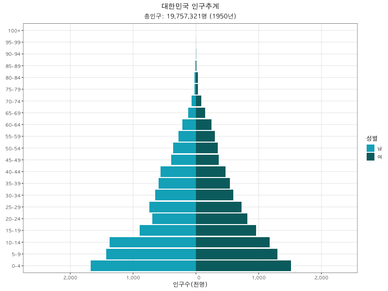
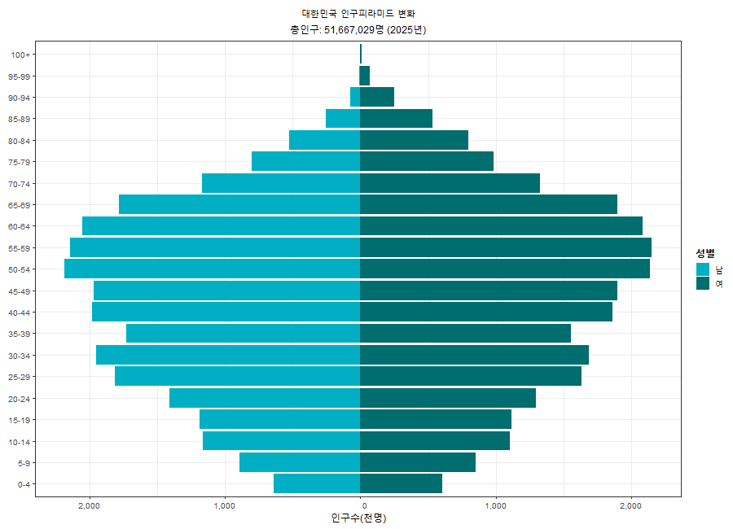

## Part 1: Lecture Slide

You can download the lecture slide here:\
\<a href="../slides/week1_demographic_change.pdf" download class="btn btn-primary"\>\
📥 Download Week 1 Lecture Slide (PDF)\
\</a\>

## Part 2: Practice: Population Pyramid

### 1. Objectives

By the end of this lecture, students will be able to:\
\
1. Understand the basic structure of a population pyramid.\
2. Use UN World Population Prospects 2024 data in R.\
3. Create a single-year population pyramid using 5-year age-group population data.

### 2. Install and Load packages

If you are running this code for the first time, install the required packages.

```{r}
#| eval: false
install.packages(
  c(
    "tidyverse",
    "wpp2024",
    "gganimate",
    "gifski"
  )
)

```

We now load the required packages for data wrangling, visualization, and animation.

```{r}
#| warning: false
#| message: false
library(tidyverse)
library(wpp2024)
library(gganimate)
library(gifski)
```

### 3. Load WPP 2024 data

The \`wpp2024\` package contains population, fertility, mortality, and projection datasets from the UN World Population Prospects 2024.

```{r}
#| warning: false
#| message: false
data(package = "wpp2024")
```

### 4. Single-year population pyramid

For this practice, we use \`popAge5dt\`, which provides population data by 5-year age group and sex. We can also check which countries are included in the dataset.

In this section, we create a population pyramid for the Republic of Korea in 2020.

```{r}
#| warning: false
#| message: false
data(popAge5dt)
head(popAge5dt)
unique(popAge5dt$name)

country_name <- "Republic of Korea"
target_year <- 2020
```

The original dataset has separate columns for male and female populations. \
We reshape the data into a long format and create a new variable, \`plot_pop\`, so that male population values are shown on the left side of the pyramid.

```{r}
#| warning: false
#| message: false

pyramid_data <- popAge5dt %>%
  filter(name == country_name, year == target_year) %>%
  select(year, age, popM, popF) %>%
  pivot_longer(
    cols = c(popM, popF),
    names_to = "sex",
    values_to = "population"
  ) %>%
  mutate(
    sex = case_when(
      sex == "popM" ~ "남",
      sex == "popF" ~ "여"
    ),
    age = factor(age, levels = unique(age)),
    plot_pop = ifelse(sex == "남", -population, population)
  )

head(pyramid_data)

total_pop <- sum(pyramid_data$population) * 1000
```

The total population is calculated by adding male and female populations across all age groups. \
Because WPP population values are given in thousands, we multiply the sum by 1,000.

```{r}
#| warning: false
#| message: false
total_pop <- sum(pyramid_data$population) * 1000
total_pop
```

We now create the population pyramid using \`ggplot2\`.

```{r}
#| warning: false
#| message: false
#| 
ggplot(
  pyramid_data,
  aes(x = age, y = plot_pop, fill = sex)
) +
  geom_col(width = 0.9) +
  coord_flip() +
  scale_y_continuous(
    labels = function(x) format(abs(x), big.mark = ",")
  ) +
  scale_fill_manual(
    name = "성별",
    values = c(
      "남" = "#00AFC4",
      "여" = "#006D6F"
    )
  ) +
  labs(
    title = "대한민국",
    subtitle = paste0(
      "총인구: ",
      format(round(total_pop), big.mark = ","),
      "명 (",
      target_year,
      "년)"
    ),
    x = NULL,
    y = "인구수(천명)"
  ) +
  theme_bw(base_size = 12, base_family = "AppleGothic") +
  theme(
    text = element_text(family = "AppleGothic"),
    plot.title = element_text(hjust = 0.5, face = "bold"),
    plot.subtitle = element_text(hjust = 0.5, face = "bold"),
    legend.title = element_text(face = "bold"),
    legend.position = "right",
    panel.grid.minor = element_blank()
  )
```

### 5. Historical population pyramid animation: 1950–2020

Now we extend the single-year population pyramid into an animated visualization to observe historical demographic changes in Korea from 1950 to 2020.

Step 1. Select historical years and prepare data

```{r}
#| warning: false
#| message: false

target_years <- seq(1950, 2020, by = 5)

historical_data <- popAge5dt %>%
  filter(
    name == country_name,
    year %in% target_years
  ) %>%
  select(year, age, popM, popF) %>%
  pivot_longer(
    cols = c(popM, popF),
    names_to = "sex",
    values_to = "population"
  ) %>%
  mutate(
    sex = case_when(
      sex == "popM" ~ "남",
      sex == "popF" ~ "여"
    ),
    age = factor(age, levels = unique(age)),
    plot_pop = ifelse(
      sex == "남",
      -population,
      population
    )
  )

head(historical_data)
```

Step 2. Create total population labels for each year

For animation, we create labels showing total population for each historical year.

```{r}
total_pop_by_year <- historical_data %>%
  group_by(year) %>%
  summarise(
    total_pop = sum(population) * 1000,
    .groups = "drop"
  ) %>%
  mutate(
    frame_label = paste0(
      format(round(total_pop), big.mark = ","),
      "명 (",
      year,
      "년)"
    )
  )

historical_data <- historical_data %>%
  left_join(total_pop_by_year, by = "year") %>%
  mutate(
    frame_label = factor(
      frame_label,
      levels = total_pop_by_year$frame_label
    )
  )
```

Step 3. Create animated population pyramid

```{r}
#| warning: false
#| message: false

p_historical <- ggplot(
  historical_data,
  aes(
    x = age,
    y = plot_pop,
    fill = sex
  )
) +
  geom_col(width = 0.9) +
  coord_flip() +
  scale_y_continuous(
    labels = function(x)
      format(abs(x), big.mark = ",")
  ) +
  scale_fill_manual(
    name = "Sex",
    values = c(
      "남" = "#00AFC4",
      "여" = "#006D6F"
    )
  ) +
  labs(
    title = "Republic of Korea",
    subtitle = "Total population: {current_frame}",
    x = NULL,
    y = "Population (thousands)"
  ) +
  theme_bw(base_size = 12) +
  theme(
    text = element_text(family = "AppleGothic"),
    plot.title = element_text(
      hjust = 0.5,
      face = "bold"
    ),
    plot.subtitle = element_text(
      hjust = 0.5,
      face = "bold"
    ),
    legend.title = element_text(face = "bold"),
    legend.position = "right",
    panel.grid.minor = element_blank()
  ) +
  transition_manual(frame_label)
```

Step 4. Render animation

```{r}
#| eval: false
#| warning: false
#| message: false

animate(
  p_historical,
  nframes = 120,
  fps = 20,
  width = 900,
  height = 650,
  end_pause = 30,
  renderer = gifski_renderer(
    "../figure/korea_population_pyramid.gif"
  )
)

```



### 6. Future population pyramid animation: 2025–2100

In this section, we use the projected population data from WPP 2024 to visualize future changes in Korea’s population structure from 2025 to 2100.

Step 1. Load projected population data

```{r}
#| warning: false
#| message: false

data(popprojAge5dt)
head(popprojAge5dt)

country_name <- "Republic of Korea"
target_years <- seq(2025, 2100, by = 5)
```

Step 2. Prepare projection data

```{r}
#| warning: false
#| message: false

projection_data <- popprojAge5dt %>%
  filter(
    name == country_name,
    year %in% target_years
  ) %>%
  select(year, age, popM, popF) %>%
  pivot_longer(
    cols = c(popM, popF),
    names_to = "sex",
    values_to = "population"
  ) %>%
  mutate(
    sex = case_when(
      sex == "popM" ~ "남",
      sex == "popF" ~ "여"
    ),
    age = factor(age, levels = unique(age)),
    plot_pop = ifelse(
      sex == "남",
      -population,
      population
    )
  )

head(projection_data)
```

Step 2. Create total population labels for each year

For animation, we create labels showing total population for each historical year.

```{r}
total_pop_by_year_projection <- projection_data %>%
  group_by(year) %>%
  summarise(
    total_pop = sum(population) * 1000,
    .groups = "drop"
  ) %>%
  mutate(
    frame_label = paste0(
      format(round(total_pop), big.mark = ","),
      "명 (",
      year,
      "년)"
    )
  )

projection_data <- projection_data %>%
  left_join(
    total_pop_by_year_projection,
    by = "year"
  ) %>%
  mutate(
    frame_label = factor(
      frame_label,
      levels = total_pop_by_year_projection$frame_label
    )
  )
```

Step 3. Create animated population pyramid

```{r}
#| warning: false
#| message: false

p_projection <- ggplot(
  projection_data,
  aes(
    x = age,
    y = plot_pop,
    fill = sex
  )
) +
  geom_col(width = 0.9) +
  coord_flip() +
  scale_y_continuous(
    labels = function(x)
      format(abs(x), big.mark = ",")
  ) +
  scale_fill_manual(
    name = "Sex",
    values = c(
      "남" = "#00AFC4",
      "여" = "#006D6F"
    )
  ) +
  labs(
    title = "Republic of Korea: Future Population Pyramid",
    subtitle = "Total population: {current_frame}",
    x = NULL,
    y = "Population (thousands)"
  ) +
  theme_bw(base_size = 12, base_family = "AppleGothic") +
  theme(
    text = element_text(family = "AppleGothic"),
    plot.title = element_text(
      hjust = 0.5,
      face = "bold"
    ),
    plot.subtitle = element_text(
      hjust = 0.5,
      face = "bold"
    ),
    legend.title = element_text(face = "bold"),
    legend.position = "right",
    panel.grid.minor = element_blank()
  ) +
  transition_manual(frame_label)
```

Step 4. Render animation

```{r}
#| eval: false
#| warning: false
#| message: false

animate(
  p_projection,
  nframes = 180,
  fps = 20,
  width = 900,
  height = 650,
  end_pause = 40,
  renderer = gifski_renderer(
    "../figure/korea_population_pyramid_2025_2100.gif"
  )
)

```


